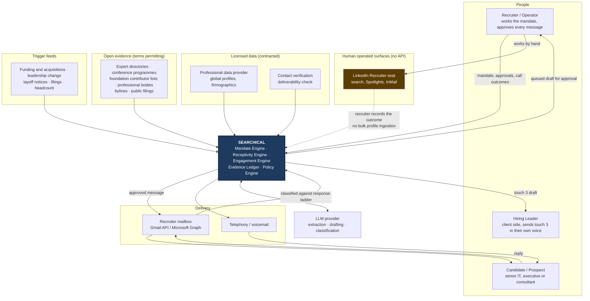
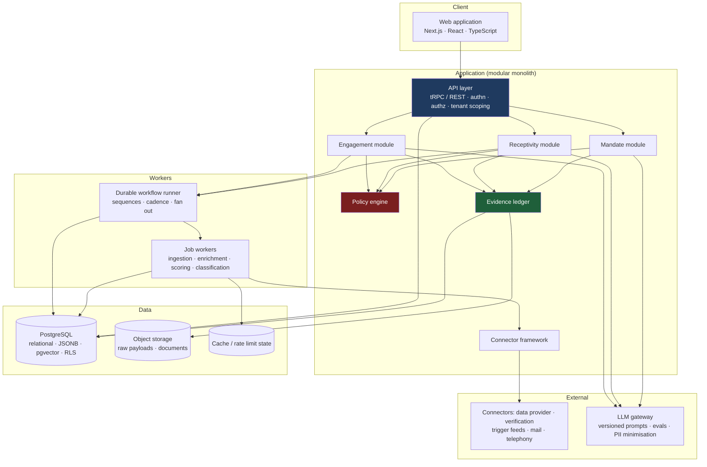
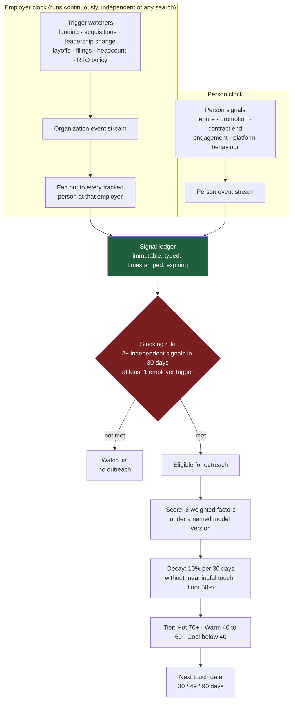
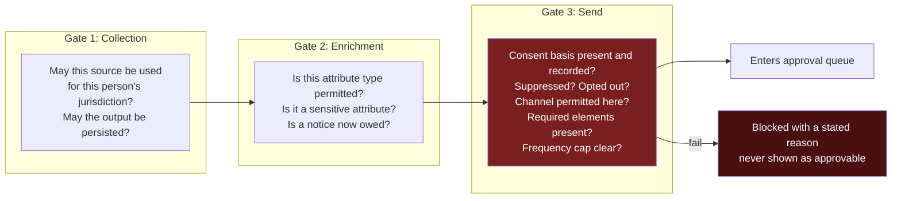
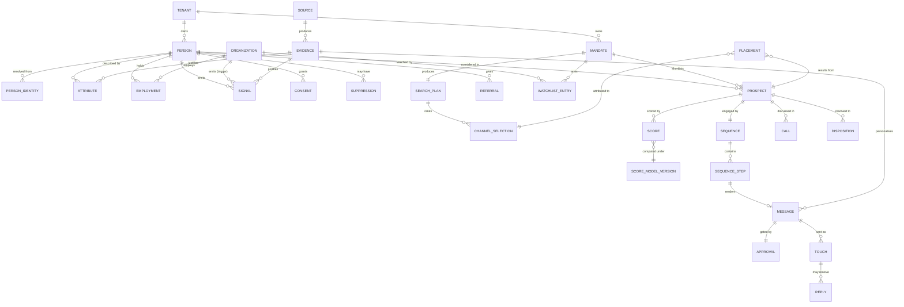
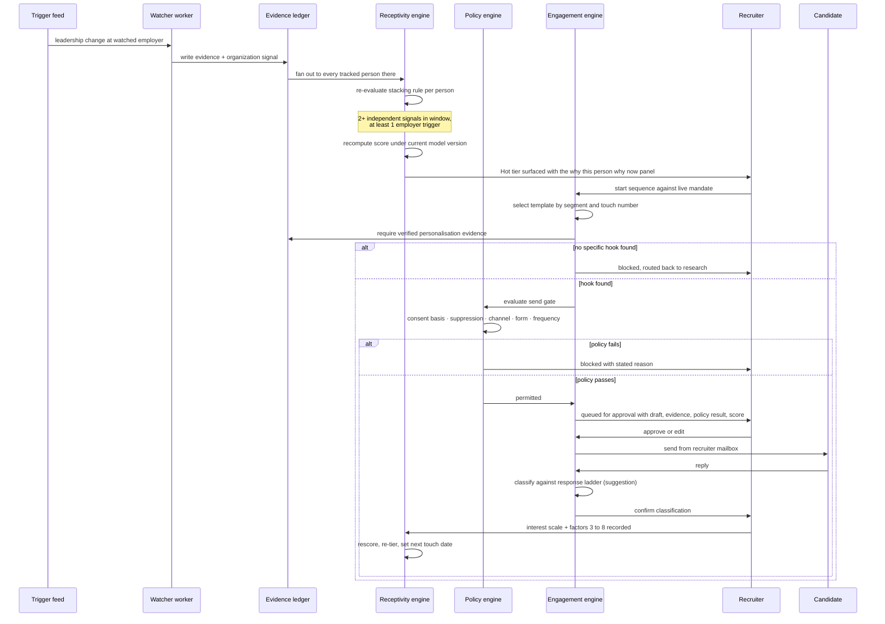

# Searchical: Technical Architecture

**Status:** Design for build. September 2026.
**Audience:** Engineers who will build, extend and operate the system.
**Companion document:** [Executive Summary](executive-summary.md), which stands alone and is assumed here.

---

## Table of contents

1. [The problem, stated precisely](#1-the-problem-stated-precisely)
2. [Design principles](#2-design-principles)
3. [System context](#3-system-context)
4. [Container view](#4-container-view)
5. [The Mandate Engine](#5-the-mandate-engine)
6. [The Receptivity Engine](#6-the-receptivity-engine)
7. [The Engagement Engine](#7-the-engagement-engine)
8. [The evidence ledger](#8-the-evidence-ledger)
9. [The policy engine](#9-the-policy-engine)
10. [The connector framework and the API landscape](#10-the-connector-framework-and-the-api-landscape)
11. [Where models are used, and where they are not](#11-where-models-are-used-and-where-they-are-not)
12. [Data model](#12-data-model)
13. [Key flows](#13-key-flows)
14. [Technology choices](#14-technology-choices)
15. [Security, tenancy and residency](#15-security-tenancy-and-residency)
16. [Build plan](#16-build-plan)
17. [Instrumentation and the feedback loop](#17-instrumentation-and-the-feedback-loop)
18. [Risks](#18-risks)
19. [Decision record](#19-decision-record)
20. [Open questions](#20-open-questions)
21. [Sources](#21-sources)

---

## 1. The problem, stated precisely

The source research establishes three findings that are not opinions and that constrain the
architecture directly. Every design decision below traces back to one of them.

**Openness is a state, not a trait.** The same person is unreachable in January and receptive in
March. Therefore the system cannot model receptivity as an attribute on a person record. It must
model it as a derivation over a stream of timestamped events, with decay, and it must watch the
employer on a separate clock from the person because employer level events make whole teams
receptive simultaneously and fire before any individual signal appears.

**There is no validated predictive model of candidate openness.** Every construct in the field,
including the eight factor model this system implements, is a practitioner or vendor heuristic.
Therefore the system must present scores as decision support, must be able to explain any score by
replaying the events that produced it, must version the model so that historical scores remain
attributable to the model that made them, and must accumulate the outcome data needed to calibrate
the model against reality. A system that hard codes the weights forecloses its own best asset.

**The first conversation is a career conversation, not a job pitch, and half measures are worse
than nothing.** Somewhat personalised outreach performs no better than no personalisation at all.
Therefore the system must make it structurally impossible to queue a message that lacks a specific,
verified, person level hook. Throughput is not the objective function. A system that makes it easy
to send more mediocre messages is value destroying, and must be designed to resist that.

To these the engineering analysis adds a fourth constraint.

**The dominant professional network cannot be ingested.** LinkedIn's Talent Solutions APIs are
partner gated and are synchronisation interfaces between an applicant tracking system and a
Recruiter seat. No member search API exists at any tier. Scraping is prohibited by a user
agreement that United States courts have held enforceable in contract, and LinkedIn litigates: the
largest LinkedIn data interface in the market was sued in January 2025 and shut down under
permanent injunction in July 2025. Therefore LinkedIn is modelled as a **human operated surface**,
not as a data source. The recruiter works the seat; the system captures the outcome of that work.

---

## 2. Design principles

These are the non negotiables. Where a later section appears to contradict one of these, the
principle wins and the section is wrong.

**1. Provenance or it does not exist.** No attribute, signal or score enters the system without a
source, a collection method, a collection timestamp, a lawful basis, a confidence value and an
expiry. There is no such thing as a bare fact in this database. This is what makes the system
lawful, what makes the right to be forgotten mechanically possible, and what gives the recruiter
the truthful specific reason for the call that the whole method depends on.

**2. Signals are immutable events; scores are derivations.** A score is never stored as an
authoritative mutable number. It is computed from the event log under a named model version and
cached. Stale signal expiry, decay and the two signal stacking rule therefore all fall out of the
event model automatically rather than being enforced by scattered update logic.

**3. The employer clock runs independently of the person clock.** Organizations are first class
entities with their own event streams and their own watchers. A trigger at an employer fans out to
every tracked person there. This is the single highest leverage mechanism in the system and it is
not a feature of the person record.

**4. Human approval is a product surface, not a safety net.** The approval queue is designed,
instrumented and measured. What was approved, what was edited, and how it was edited is training
data and a quality metric, not an audit afterthought.

**5. Policy is evaluated by machine, at the moment of action.** Jurisdiction, consent, suppression
and channel etiquette are evaluated at three gates: collection, enrichment and send. A message
that fails policy never reaches the approval queue, so a human is never asked to rubber stamp an
unlawful send.

**6. Every connector declares its constraints in code.** A connector states what it yields, on what
lawful basis, under what rate limits, and critically **whether its output may be persisted or must
remain ephemeral**. The LinkedIn constraint is expressed in the type system, not in a wiki page
that nobody reads.

**7. The scoring model is versioned configuration and is backtestable.** Weights, decay, tier
thresholds and cadence intervals are data. Changing them creates a new version. Historical scores
are never silently rewritten, and the system can replay history under a new model to show whether
it would have ranked better.

**8. Single tenant launch, multi tenant schema.** Every row carries a tenant identifier and row
level security is on from the first migration. Retrofitting tenancy into a live system with a
consent ledger in it is close to a rewrite.

**9. Degrade gracefully as sources come and go.** Data providers get acquired, change terms, and
get sued. The system must stay useful when any single source disappears, and it must show the
operator which parts of a market map are thin rather than presenting a partial answer as a
complete one.

**10. Build the feedback loop before the dashboard.** Source of hire capture, outcome linkage and
score calibration are instrumented in phase one even though they are not reported until phase four.
A dashboard over uninstrumented data is decoration.

---

## 3. System context



The critical read of this diagram is the **dotted line from the LinkedIn Recruiter seat**. It is
dotted because it is a human carrying an outcome across an air gap, not an integration. Everything
that looks like a pipe in a competitor's architecture diagram is a person here, deliberately.

---

## 4. Container view



**A modular monolith, not microservices.** The team is small, the domain boundaries are not yet
proven, and the dominant cost in this system is data consistency across the person, signal, score
and consent tables. Distributed transactions across those would be a self inflicted wound. The
module boundaries are enforced in code (separate packages, no cross module imports except through
published interfaces) so that any module can be extracted later if load or team shape demands it.
The workers are separate processes from the first day because their failure and scaling
characteristics genuinely differ from the request path.

**The policy engine and the evidence ledger are drawn in different colours because they are
crosscutting and mandatory.** No module writes a fact without the ledger, and no module performs an
outward action without the policy engine. These are not services you may call; they are the only
path.

---

## 5. The Mandate Engine

**Purpose:** turn a job specification into an executable search strategy. This is the Outreach
Channel Matrix workbook expressed as software, plus the intake discipline the workbook assumes but
cannot enforce.

### 5.1 Pipeline


### 5.2 The step that everything else depends on

The hard part of translating a job description into a search is not Boolean syntax. It is market
vocabulary. **A language model will write an excellent search string for the wrong search**,
because it does not know that this market calls the role something else, or that the title the
hiring manager invented does not exist at the companies you should be targeting. This is the
single most common failure mode in automated sourcing and the system is designed specifically to
defeat it.

**The same failure occurs one level higher, at the segment.** A specification for a role the
practice does not recruit will be forced into the nearest supported segment unless the system can
say otherwise, and the channel plan that follows is confidently, uselessly wrong. Triage therefore
runs before anything else and has its own verdict: out of scope, with the reasoning attached. See
decision record entry 13.

Three mechanisms, layered.

First, extraction produces *candidate* title variants, never final ones, and each carries a
confidence value and the evidence that produced it.

Second, every proposed variant is **validated against observed reality** before it is offered. The
system queries the licensed provider for the actual distribution of titles held by people matching
the capability profile inside the target company set, and ranks the variants by observed frequency.
A variant the model proposed that appears zero times in the target universe is shown struck through
with its count, not silently dropped, because a zero count is itself information the recruiter
needs.

Third, the recruiter confirms. The mandate does not go live until a human has accepted or edited
the title variants, the must have skills and the exclusion terms. **This gate is not removable.**

### 5.3 Performance based intake

Extraction populates a structured intake that mirrors the Adler discipline the source research
endorses: what must this person accomplish in the first year, what operating range is required, and
why would a strong person consider this a career move rather than a lateral one. Where the job
specification does not answer those questions, and most do not, the system generates the specific
questions to put to the hiring leader and records the answers against the mandate.

This is not decoration. The answer to *why is this a career move* becomes the substance of touch
two and touch three, and the four or five gaps the opportunity closes become the career move test
in the exploratory call. A mandate with an empty career move field will produce a sequence that
pitches a lateral role, which the research identifies as a primary reason senior people ignore
recruiters.

### 5.4 Channel planning

Channel fit ratings are seeded from the Outreach Channel Matrix, twenty nine channels rated one to
five per persona, and are stored **per tenant as mutable data, not as constants**. Channels rated
at or above the primary threshold are primary; at or above the secondary threshold are secondary;
below that they are shown as explicitly skipped with the reason, because knowing what was
deliberately not done is part of the plan.

The planner targets three to five channels in combination, weighted toward warm and network
channels for senior and passive targets. Each channel carries an owner, a status and an etiquette
note surfaced at the point of use rather than buried in documentation. When a recruiter opens a
community channel, the no cold outreach rule is on the screen.

Phase four writes source of hire outcomes back into these ratings, so the matrix converges on the
practice's own results rather than published industry averages. This is the mechanism by which the
system stops being a copy of a spreadsheet and starts being proprietary.

### 5.5 Pipeline arithmetic

Deterministic, transparent, and shown as a working rather than a number:

```
contacts_required = ceil(target_conversations / (response_rate x interested_share))
```

Defaults come from the source research: a twenty percent combined response rate and a fifty percent
interested share, which means ten real conversations requires roughly one hundred people contacted
and a long list that must reach at least that size. The system **warns when the long list is
smaller than the contacts required**, because that specific gap is the most common silent failure
in a search, and it offers the talent map widening moves from the Channel Guide rather than just
flagging the problem.

As the practice accumulates history, the defaults are replaced per segment and per channel by the
practice's own observed rates, with the sample size shown alongside so the recruiter knows whether
to trust the number.

---

## 6. The Receptivity Engine

**Purpose:** determine who to approach and when. This is the Candidate Receptivity Scorecard as
software, with the event model the spreadsheet could not express.

### 6.1 The two clocks



**The employer clock is the highest leverage mechanism in the system.** One return to office
mandate makes a whole floor receptive. One chief executive departure makes the layer below
receptive. These events are dateable, publicly observable, and they fire *before* any individual
behavioural signal appears, which means a practice watching employers reaches people before the
several recruiters who wait for an open to work badge. The system therefore watches organizations
whether or not there is an active mandate against them, and the target company list from every
mandate is permanently added to the watchlist.

Relevance decays fast on these events. A layoff announcement is worth acting on within days. The
system models each trigger type with its own half life rather than applying one global window.

### 6.2 Signals

Twenty three signal types are seeded from the Signals Checklist, each with a category (LinkedIn
platform, LinkedIn behaviour, career stage, employer trigger, compensation cycle, personal,
personal brand, engagement data, relationship), a strength rating that maps to points, a recency
window, and a cited source.

Every signal instance is an immutable row carrying its provenance. Signals are never updated; a
contradicting observation is a new signal, and the resolution happens at derivation time. This
makes the audit trail free and makes "why did this person's score change on 14 March" answerable
by replay rather than by guesswork.

Three rules are enforced mechanically rather than left to discipline.

**A single signal is noise.** The stacking rule requires two or more independent signals inside the
recency window, with at least one employer level trigger, before a person becomes eligible for
active outreach. Combining one employer trigger with one individual behaviour produces the highest
confidence shortlist, and the system enforces exactly that shape.

**Stale signals expire.** A signal outside its recency window contributes nothing. It stays in the
ledger for audit and replay, but it does not reach the derivation.

**Sensitive attributes are quarantined.** Age, generation, life stage and other protected or
sensitive grounds correlate with receptivity in the survey data, and the source research is
explicit that they may be used for timing and prioritisation but never as selection criteria.
These are stored in a separate namespace, are excluded from every scoring input by schema rather
than by convention, and any query that touches them is logged. **Making this a structural property
rather than a policy is the only version of this control that survives contact with a deadline.**

### 6.3 Scoring

Eight factors, weighted, each scored zero to five, producing a raw score out of one hundred. The
weights ship as the source research defines them: pre contact signals ten percent, interest scale
position twenty, buying cues ten, push factors fifteen, motivator match twenty, timing readiness
ten, freedom from deal breakers ten, and compensation openness five.

Factor one derives automatically from the signal ledger. Factor two derives from the recorded
interest scale answer. Factors three through eight are recorded by the recruiter from the
exploratory call, against the published anchors for zero, three and five.

Decay applies ten percent per thirty days without a meaningful touch, with a floor of half the raw
score so that a strong candidate never vanishes but an untouched one sinks. Tiers and cadence
follow the seeded thresholds. All of these are configuration under a model version, not constants
in code.

**Every score carries the model version that produced it and an explanation payload**: the signals
that contributed, the factor values, the decay applied, and the resulting tier. The interface shows
this as *why this person, why now*, in the recruiter's language, because that explanation is also
the raw material for the opening line of the approach.

### 6.4 Backtesting, which is the point

When weights change, a new model version is created. Historical scores are not rewritten. The
system can then replay the entire history of the practice under the new version and report whether
the revised model would have ranked actual outcomes better, measured as lift of Hot over Warm over
Cool on conversion to exploratory call and to placement.

This is how a practitioner heuristic becomes a calibrated model. It requires only that the outcome
linkage is captured from day one, which is why it is instrumented in phase one and reported in
phase four. **The practice that runs this loop for two years owns something the market does not
have. The practice that skips it owns a spreadsheet with a nicer interface.**

### 6.5 Identity resolution

People arrive from multiple sources with partial identifiers. Resolution runs in tiers:
deterministic on verified email or a provider stable identifier; then strong heuristic on name plus
employer plus role window; then probabilistic with a confidence threshold below which the system
**asks the recruiter rather than guessing**. Every merge and every split is an audited, reversible
event, because a bad merge in a system holding consent records is a compliance incident, not just a
data quality annoyance.

---

## 7. The Engagement Engine

**Purpose:** run the approach. Five to six touches, multiple channels, drafted by the system,
approved by a human, sent from a real person's mailbox, and stopped the moment it should be.

### 7.1 The sequence as a durable workflow

A sequence spans up to twenty one days, changes channel between touches, must cancel instantly on
a reply or an opt out, must survive process restarts and deployments, and must never double send.
That is a durable workflow problem, not a cron job, and it is modelled as one.

The default sequence ships as the source research defines it: touch one on day zero (LinkedIn
connection note for consultants, short InMail or warm introduction for executives), touch two on
day three to five (the reason you email from the recruiter), touch three on day seven to ten (email
in the hiring leader's voice, which the evidence associates with materially higher reply rates),
touch four on day ten to fourteen (phone then voicemail, referral anchored), touch five on day
fourteen to eighteen (the polite close, which is often the highest converting message in the
sequence), and an optional touch six around day twenty one.

**The system enforces the stop.** Engagement flattens after stage five and over sequencing
irritates senior candidates and damages the brand. Five is the default ceiling, six requires an
explicit reason, and there is no configuration that permits eight.

### 7.2 Drafting, and the personalisation gate

Templates one through eight from the Playbook ship as structured objects, not free text: each
declares its channel, its position in the sequence, its length ceiling, its required personalisation
tokens, and the principles it applies with their citations.

Length ceilings are enforced at composition, not suggested: LinkedIn messages under four hundred
characters, first emails under about one hundred and eighty words.

The gate that matters is this. **A message cannot enter the approval queue unless at least one
required personalisation token is filled from a verified, person specific evidence record with a
live citation.** Not a company name. Not a job title. A specific talk, repository, byline, program
or achievement, with a source and a date, that a human could check. If the system cannot find one,
it says so and routes the person back to research rather than producing a passable generic message.

This is the single most important constraint in the engagement engine, because the evidence says
that somewhat personalised outreach performs no better than none. A system that quietly degrades to
generic when research is thin is worse than useless: it burns the addressable market and the brand
at speed. **Refusing to send is a feature.**

### 7.3 Approval

Every outbound message enters a queue with the draft, the evidence behind the personalisation, the
policy evaluation result, the person's score explanation, and the full prior thread. The approver
accepts, edits or rejects with a reason.

Edits are captured as diffs. Over time the accepted and edited corpus becomes the practice's house
voice and the measure of whether the drafting is actually good. **If recruiters rewrite everything,
the drafting is theatre and the metric will say so.** Approval SLA is tracked because a queue that
backs up silently converts a well timed trigger into a stale one.

### 7.4 Sending

**Outreach sends from the recruiter's own mailbox via the Gmail API or Microsoft Graph, not through
a bulk email service provider.** This is a deliberate and slightly unusual choice, and it is right
for four reasons. Deliverability for genuinely one to one senior outreach is better from a real
human mailbox with real sending history than from a marketing domain. Authenticity is the product:
a reply goes to a real inbox that a real person reads. Canadian anti spam identification
requirements are satisfied naturally by a real identified sender. And the touch three pattern,
where the message comes from the hiring leader rather than the recruiter, requires sending as a
different real person, which an email service provider models badly and a mailbox integration
models exactly.

The cost is per mailbox rate limits and per mailbox reputation management, both of which the system
tracks. This is the correct trade for a senior search practice and would be the wrong trade for a
volume recruiting product, which is a useful signal that the architecture is aimed correctly.

### 7.5 Replies and the response ladder

Inbound replies are ingested, threaded, and classified against the eight rung response ladder:
explicit not interested, silence after the full sequence, polite decline but engaged, keep me in
mind, a question about scope or team, a question about compensation, agreement to a confidential
conversation, and a referral of a colleague.

Classification is a suggestion with a confidence value. **The recruiter confirms it**, because the
classification drives the interest scale value, the suggested buying cues score, the disposition
and the entire downstream cadence, and because these rungs are practitioner heuristics rather than
validated predictors.

Each rung carries its prescribed action, and the system takes it: stop cleanly and record the date;
route to nurture and ask what the ideal opportunity would look like; log the timing trigger and
schedule the next touch to it rather than to a generic interval; answer briefly and move to a
fifteen minute exploratory call; set disposition to Source and chase the referral within forty
eight hours.

The distinction the system is built to preserve is between **not interested** and **not actively
looking**. Almost everyone is the second at some point. Any reply that engages, even one declining
this specific role, indicates latent openness and must not be treated as a dead end, because the
relationship is the asset.

### 7.6 The exploratory call

The call is where the real scoring data is produced, so the system supports it directly rather than
leaving it to notes. The recruiter gets the six stage structure with its timings, the attributed
question bank filtered to the current stage, and inline capture for the interest scale answer,
factors three through eight, push factors, the dominant motivator, deal breakers, the timing
trigger and the referrals given.

Two disciplines are built in. **Compensation is not raised before the mid point of the call**, and
the interface does not offer the field before then. **The referral ask is a required field at
close**, not an optional one, because the standard is two to three warm referrals from every
exploratory call and the single most reliable way to miss that standard is to not ask.

Disposition is mandatory at close: Candidate, Prospect, Source or Opted out. A Source who gives two
strong referrals is a successful call at a low receptivity score, and the system records it as
such rather than as a failure.

---

## 8. The evidence ledger

Every fact in Searchical is a row in an append only ledger carrying:

| Field | Purpose |
| --- | --- |
| `source_id` | Which connector, directory, provider or human produced it |
| `collection_method` | `provider_licensed`, `public_evidence`, `recruiter_entered`, `candidate_provided`, `inferred` |
| `collected_at` | When, to the second |
| `lawful_basis` | The basis relied on, per jurisdiction |
| `confidence` | Zero to one, set by the connector, not guessed downstream |
| `expires_at` | When this fact stops counting, by type |
| `raw_ref` | Pointer to the stored raw payload in object storage |
| `superseded_by` | Set when a later observation replaces it; never deleted |

This buys four things that are otherwise expensive or impossible.

**The right to be forgotten becomes a mechanical operation.** The executive search profession's own
standards grant candidates the right to have their name removed from a firm's database on request,
and European law grants an equivalent. Because every fact points at a person through the ledger, a
forget request is a tombstone plus a cascade, executed and provable in one transaction, with the
suppression record itself retained so the person is not accidentally re-acquired from a provider
next month. **That last detail is the one most implementations get wrong.**

**The notice obligation becomes automatic.** Where data about a person was collected without their
knowledge, European law requires a notice to that person within a reasonable period. The system
knows exactly which facts were indirectly collected, from which source and when, so it can generate
and dispatch that notice from the record rather than from a manual process nobody will run.

**Explanation becomes free.** Any score replays from the ledger under its recorded model version.
Any personalisation token in any message points at the evidence that justified it.

**Provider churn becomes survivable.** When a data source is terminated or its terms change, the
facts it produced are identifiable in one query and can be expired, re-verified or purged as the
contract requires.

Raw payloads are stored separately from derived facts, with a shorter retention, because keeping
a full provider payload forever is a liability with no operational benefit once the fields you use
have been extracted and attributed.

---

## 9. The policy engine

Policy is evaluated by machine at three gates. A human is never asked to approve something the
system already knows is not permitted.



### 9.1 Canada, which binds from launch

Canada's anti spam legislation is the operative constraint on outreach and is stricter than the
American equivalent. Recruiting outreach that promotes the practice's commercial activity is a
commercial electronic message. Three implementation consequences follow.

**Consent must be recorded, not assumed, because the burden of proof sits with the sender.** The
system stores a consent record per person per basis: express consent with its capture context, or
implied consent with its category. The category the practice will rely on most is conspicuous
publication, which requires three conditions together: the person published the business address
themselves, no notice beside it refuses commercial messages, and the message relates to their role
or business. **The system records which of the three was satisfied, from which source URL, on what
date, and stores the captured evidence.** Other implied consent categories carry their own clocks,
an existing business relationship running twenty four months and an inquiry running six, and the
system expires them automatically rather than letting a stale basis quietly persist.

**Form requirements are enforced at composition.** Sender identification, a valid mailing address
and a working unsubscribe are structural elements of every outbound commercial message, not
template text an operator can delete.

**Unsubscribes are honoured within the statutory window,** which the system treats as immediate
rather than as ten business days, and propagate across every channel and every mandate at once.

Federal privacy law and Quebec's Law 25 govern collection and retention. Law 25 requires a privacy
impact assessment before personal information is transferred outside Quebec, which makes the
hosting region a legal decision as much as a technical one. Canadian residency is the recommended
default.

### 9.2 Europe, which applies on identification

European personal data enters the database during global identification regardless of where
outreach is sent. The obligations that bite are the notice owed for indirectly collected data, the
right to object, and a documented legitimate interest assessment held on file for the sourcing
activity. All three are generated from the ledger.

The European artificial intelligence regime deserves precision because the commonly cited date is
now wrong. Recruitment and candidate ranking tools sit in the high risk annex, and those
obligations were legislated to apply from 2 August 2026. The Digital Omnibus, Regulation (EU)
2026/1744, published 24 July 2026 and in force from 27 July 2026, moved them to 2 December 2027.

**Build for them now anyway.** The deferred obligations are risk management, data governance,
record keeping, human oversight and technical documentation, and every one of them is an order of
magnitude cheaper designed in than retrofitted. This architecture provides all five as a byproduct
of the evidence ledger, the versioned scoring model, the approval queue and the audit log. The
deferral is useful as sequencing room, not as permission to skip.

### 9.3 United States, for when outreach extends

The federal anti spam regime is more permissive than Canada's. The state level artificial
intelligence in employment rules are the live constraint: New York City has required annual
independent bias audits of automated employment decision tools since 2023, and Illinois amended its
human rights act with effect from 1 January 2026 to address artificial intelligence in employment
decisions. Colorado's act has been repeatedly amended and delayed and should be re-checked rather
than assumed.

**The architectural answer to all of them is the same:** Searchical prioritises and sequences
outreach, and a human makes every decision that affects a person's candidacy. Keeping the system
out of the automated employment decision category is a design constraint, not an accident, and it
is one of the reasons the scoring model is deterministic and explainable rather than a learned
ranker.

### 9.4 Professional standards and channel etiquette

The executive search profession's standards are encoded as system behaviour rather than as
training: initial discussions may proceed without naming the client, and the mandate therefore
carries an explicit confidentiality level that governs what any generated message may disclose; the
client is identified at the appropriate stage, which the system gates; and a non selected candidate
retains a right to be forgotten.

Channel etiquette is data attached to each channel and surfaced at the point of use. The Canadian
chief information officer association prohibits recruiting in conjunction with its activities.
Senior developer communities on Reddit, Slack and Discord ban unsolicited outreach outside
designated channels. GitHub's acceptable use policies specifically prohibit using its API or
scraping to sell user information to recruiters and headhunters. **These are not suggestions the
system offers; they are constraints that block the action and explain why.**

### 9.5 A standing caution

I am not a lawyer, and several statements in this section were verified through secondary legal
analysis because this session's network could not reach the primary regulator pages. Canadian
privacy and anti spam counsel should review this section before the first message is sent, and the
Quebec privacy impact assessment should be commissioned before the hosting region is fixed.

---

## 10. The connector framework and the API landscape

### 10.1 The capability contract

Every external source implements one interface that declares its constraints, so that a limit which
is legal or contractual becomes a property the type system enforces:

```ts
interface Connector {
  id: string;
  yields: EntityType[];                 // person, organization, employment, signal, contact
  lawfulBasis: LawfulBasis;             // per jurisdiction
  persistence: 'persist' | 'ephemeral' | 'manual_entry_only';
  jurisdictions: Jurisdiction[];        // where output may lawfully be used
  rateLimit: RateLimitPolicy;
  freshness: Duration;                  // how long output stays trustworthy
  confidence: ConfidenceProfile;        // by field
  termsRef: string;                     // the contract or policy relied on
  coverage: CoverageProfile;            // by region, so thin maps are visible
}
```

`persistence: 'manual_entry_only'` is the LinkedIn case and it is the reason the contract exists.
The constraint is expressed once, in code, and no future engineer can accidentally violate it by
adding a pipeline.

### 10.2 LinkedIn, precisely

**What exists.** LinkedIn Talent Solutions offers a partner gated API set: Recruiter System
Connect, which synchronises candidate records between an applicant tracking system and a Recruiter
seat; CRM Connect, which exports member profiles a recruiter has already surfaced into an external
system and shows profiles inside it; Apply Connect, which lets candidates apply without leaving
LinkedIn; Apply with LinkedIn, for career sites; and the Job Posting API. Access requires approved
Talent Solutions Partner status and a signed agreement carrying data restrictions.

**What does not exist at any tier: an API to search the member base.** Sourcing happens in a human
operated Recruiter seat. That is a product decision by LinkedIn, not a gap awaiting a workaround.

**Why the workaround is not available.** LinkedIn's user agreement prohibits scraping, and United
States courts have held such prohibitions enforceable as contract even where public data scraping
survives computer misuse statutes. LinkedIn enforces aggressively: it sued the largest LinkedIn
data interface in the market in January 2025 and that business shut down under permanent injunction
on 4 July 2025, deleting its data.

**Therefore, the design.** The recruiter operates the Recruiter seat, which remains the
identification backbone and the place where the platform's own intent signals live. Searchical
captures the outcome of that work: the person, the reason they were surfaced, which Spotlight fired,
and the recruiter's assessment. It does not ingest the platform.

**One future option worth knowing about.** If the practice ever operates its own applicant tracking
system at sufficient scale, applying for Talent Solutions Partner status would unlock Recruiter
System Connect and genuinely useful two way synchronisation with the Recruiter seat. It is a long
and selective process. Widely repeated figures about approval rates and timelines circulate on
vendor blogs and I could not verify them from LinkedIn, so I have not repeated them here. It is
worth exploring as a phase five item, and it is not a dependency for anything before that.

### 10.3 Licensed professional data, which is where global reach comes from

This is the layer that makes worldwide identification real, and it is now in scope.

The market divides into aggregators that license bulk or queryable professional profile data, and
sourcing platforms that wrap similar data in a recruiter workflow. Both are usable; the first
integrates cleanly, the second sometimes offers no API at all.

**Selection should be by paid bake off, not by demonstration.** Vendor accuracy and productivity
claims in this category are self reported and the one independent test located during research
found raw valid email rates between roughly sixty five and seventy one percent against advertised
accuracy near ninety nine percent. Score candidates on four axes, in this order.

First, **coverage in your actual target geographies and seniority band**, tested against a list of
people you already know. A provider that is excellent in United States technology sales and thin in
Canadian public sector infrastructure is the wrong provider for this practice regardless of its
headline profile count.

Second, **the contractual answer to one question: on what lawful basis was this data collected,
will you warrant it, and will you indemnify us.** This question is the entire diligence. A provider
that cannot answer it crisply is selling you a liability with an API in front of it.

Third, **query model**, specifically whether you can express the searches this practice actually
runs: capability plus target company set plus seniority plus geography, and whether firmographic
change data is available as a feed rather than only as a point in time lookup.

Fourth, **exit terms**, including what happens to derived records if the contract ends or the
provider is acquired or enjoined. Given what happened in this market in 2025, this is not
theoretical.

Integrate whichever wins behind the connector interface so that the second provider, and the
replacement for the first, is a configuration change.

### 10.4 Open evidence sources, where the credible opener comes from

These are lower volume and higher value. They rarely give you contact details, but they give you
the specific, checkable hook that the personalisation gate requires, and they are frequently the
only way to identify genuinely senior technical talent that is invisible on a professional network.

Public expert directories are effectively pre vetted shortlists and are filterable by country: the
major cloud and platform vendor ambassador and most valuable professional programmes, and the
foundation ambassador and contributor lists in the cloud native ecosystem. Conference and meetup
programmes are published lists of senior people who have been selected by their peers, and speaker
lists double as talent maps. Foundation contributor records verify depth in a way a profile cannot.
Professional bodies and certification chapters concentrate senior security, project and governance
professionals. Public company filings, regulatory registers and grant and patent records identify
leadership and inventors. Academic and open research identifiers cover research heavy roles.

Code hosting platforms sit in a special category. They are the deepest verification surface for
technical depth, and they are the most hostile to recruiters, with acceptable use policies that
explicitly prohibit using the platform to sell user information to recruiters and headhunters and a
community norm that punishes cold contact. The correct use is **verification and opener material
for a person you identified elsewhere**, never bulk identification, and the connector is configured
accordingly.

For each of these the connector records the terms relied on. Several are ordinary public web pages
with no API, which means a fetch and parse connector with conservative rate limiting and a stored
raw payload. That is acceptable where the terms permit it and the volume is human scale. It is not
acceptable anywhere the terms prohibit it, and the connector contract is where that judgment is
recorded rather than remembered.

### 10.5 Trigger feeds, which are the highest leverage integration in the system

The employer clock needs dateable events. Funding, acquisition and ownership data is available from
the major private market data platforms under licence and several offer feed access. Leadership
change is observable through filings, regulatory registers and press release feeds. Layoffs and
restructuring are observable through statutory advance notice registers in several jurisdictions
and through the established monthly job cut reports. Headcount trajectory is available from most
professional data providers as a firmographic time series. Return to office policy changes are
announced publicly and are best captured through a monitored news and press release feed scoped to
the watchlist.

**Spend the integration budget here before spending it on more profile data.** The practice's own
research is unambiguous that employer level triggers outrank individual behaviour, that they fire
first, and that relevance decays within days. A system that knows about a reorganisation on the day
it is announced, against a watchlist of the two hundred employers this practice actually recruits
from, is worth more than a system that can see another hundred million profiles.

### 10.6 Delivery and verification

Outreach sends through the Gmail API or Microsoft Graph on the sending recruiter's own mailbox, for
the reasons given in section 7.4. Contact verification runs as a separate connector immediately
before any first send, on the working assumption that an unverified export is roughly sixty percent
deliverable, with bounce results written back to the ledger as evidence so that provider quality
becomes measurable rather than asserted.

### 10.7 Global coverage, honestly

Coverage is uneven and the system must show it rather than hide it. Professional data coverage is
deep in North America, the United Kingdom, Western Europe, India and Australia. It is materially
thinner in Japan, Korea and much of Latin America, where domestic professional platforms hold the
senior population and generally offer no recruiter facing interface to a foreign firm. In mainland
China the professional network of record is not accessible, and the honest answer is that
identification there runs through partners, alumni networks and referral rather than through data.

Every market map therefore carries a **coverage confidence per region**, and the interface states
when a result set is thin because the data is thin rather than because the market is small. A
search that returns eleven people in Tokyo and presents them as the market is worse than a search
that returns eleven people and says so.

---

## 11. Where models are used, and where they are not

The governing rule: **no model output ever causes an outward facing action, or changes a ranking,
without either a deterministic rule or a human between it and the effect.**

Language models are used for structured extraction from job specifications and documents, for
proposing market vocabulary variants that are then validated against observed data and confirmed by
a human, for drafting messages that a human approves, for classifying replies into a suggested
response ladder rung that a human confirms, and for summarisation of call notes and research.

Language models are **not** used to compute the receptivity score, to decide outreach eligibility,
to decide who is shortlisted, to send anything, or to assess a candidate's suitability for a role.
Those paths are deterministic, explainable and replayable.

This is partly a regulatory posture, because it keeps the system clear of the automated employment
decision tool category and satisfies the human oversight expectations of the European regime ahead
of their application. It is mostly an engineering judgment: a learned ranker over a few thousand
practitioner scored records would be a confident, unauditable, unfixable number, and the system's
entire value proposition rests on being able to answer *why this person, why now* truthfully.

Operationally, prompts are versioned artefacts with evaluation suites that gate deployment;
personal data sent to the model is minimised to what the task needs; candidate data is excluded
from any provider training; and every model call is logged with its prompt version, inputs
reference and output for audit and replay.

---

## 12. Data model

### 12.1 Entity relationships



### 12.2 The tables that carry the design

Everything else is ordinary. These five are where the principles live.

**`evidence`** is the spine. Append only. Carries `source_id`, `collection_method`,
`collected_at`, `lawful_basis`, `confidence`, `expires_at`, `raw_ref`, `superseded_by`. Nothing
factual exists in this system except by pointing at a row here.

**`signal`** is immutable and typed. Carries `subject_type` (person or organization),
`subject_id`, `signal_type_id`, `observed_at`, `expires_at`, `evidence_id`. Never updated. A
contradiction is a new row, resolved at derivation time. The two clocks in section 6.1 are just
this table filtered by `subject_type`.

**`score`** carries `prospect_id`, `model_version_id`, `raw_score`, `decayed_score`, `tier`,
`computed_at`, and an `explanation` JSONB payload holding the contributing signals, the factor
values, the decay applied and the tier boundary crossed. Scores are inserted, never updated, so
the score history of a relationship is itself queryable and is the input to backtesting.

**`consent`** carries `person_id`, `basis` (express or one of the implied categories),
`captured_at`, `expires_at`, `evidence_id`, and for the conspicuous publication case the three
condition flags and the source URL that satisfied them. Section 9.1 is this table.

**`suppression`** is separate from `consent` and outlives the person record deliberately. A person
who asks to be forgotten leaves a suppression record with a hashed identifier and no personal data,
so that re-acquisition from a data provider next month is caught and blocked rather than quietly
starting the relationship over. **This table must never be cascaded away by a delete.**

### 12.3 Conventions

Every table carries `tenant_id`, and row level security is enabled from the first migration with
policies keyed to the session's tenant claim. Every table carries `created_at` and, where mutable,
`updated_at`. Immutable tables (`evidence`, `signal`, `score`, `touch`, `reply`, `approval`) carry
no update path at all, enforced by grant rather than by convention.

Sensitive attributes live in a separate table with its own grants, are excluded from scoring inputs
by schema, and every read is logged. See section 6.2.

Person facing free text (call notes, message bodies) is indexed for full text search. Capability
and role descriptions are additionally embedded into `pgvector` columns for semantic matching, so
that a mandate can find people whose stated experience means the same thing in different words,
which is the practical answer to the market vocabulary problem at the retrieval layer.

---

## 13. Key flows

### 13.1 Employer trigger to approved outreach

This is the flow that expresses the whole system, so it is worth reading closely.



Two properties to note. **The blocked paths are first class**, not error handling. Refusing to send
a generic message and refusing to send an unlawful one are both normal, expected, instrumented
outcomes. And **the loop closes**: the reply feeds the score, which feeds the cadence, which feeds
the next touch.

### 13.2 Job specification to live mandate

Covered as a pipeline in section 5.1. The only gate that matters is the recruiter confirmation of
market vocabulary, which is not removable.

### 13.3 Forget request

A forget request writes a suppression record, tombstones the person, cascades to attributes,
signals, scores, messages and evidence, cancels every scheduled touch across every mandate, and
retains only the hashed suppression identifier and the audit trail of the deletion itself. The
operation is a single transaction and produces a certificate the practice can send to the person.

---

## 14. Technology choices

Deliberately mainstream, deliberately boring. The constraint is a small team and a large hiring
pool, and every choice below is reversible at acceptable cost except the database.

| Layer | Choice | Why | Rejected alternative |
| --- | --- | --- | --- |
| Language | TypeScript end to end | One language across web, API and workers. Largest hiring pool for this kind of product. Shared types between client and server remove an entire class of bug | Python backend, which would split the stack for no gain here since the machine learning work is deterministic scoring, not model training |
| Web | Next.js with React | Mature, well understood, server rendering where it helps, one deployment story | A separate single page application plus API, which adds a deployment and auth seam for no benefit at this size |
| API | tRPC internally, REST at the edge | End to end type safety internally; a conventional REST surface for connectors and any future integration | GraphQL, which adds schema and caching complexity that a single first party client does not need |
| Datastore | PostgreSQL | Relational integrity for consent and provenance, JSONB for flexible attributes, `pgvector` for semantic matching, full text search, row level security for tenancy. One system instead of four | A document store, which would make the consent and evidence integrity guarantees application level and therefore eventually wrong |
| ORM | Drizzle | SQL first, thin, migrations you can read. Matters in an audit heavy schema where you must be able to see exactly what runs | A heavier ORM that obscures the generated SQL |
| Workflows | Durable workflow engine for sequences and cadence | Twenty one day workflows with cancellation on reply, exactly once sends and survival across deploys. Start with a Postgres backed durable queue; adopt a dedicated workflow engine when sequence complexity or volume justifies the operational cost | Cron plus status columns, which is how double sends and stuck sequences happen |
| Background jobs | Postgres backed queue | No extra infrastructure to operate; transactional enqueue with the write that triggered it, which removes a whole class of lost job | A Redis backed queue, which adds a component and loses transactional enqueue |
| Auth | Managed provider with organization support | Tenancy, session claims for row level security, and enterprise sign on later without a rewrite | Rolling our own, which is never the right call for a system holding this data |
| Models | Claude via the Anthropic API, behind an internal gateway | Strong structured extraction and drafting; the gateway gives prompt versioning, evaluation gating, cost control and provider portability | Calling a provider SDK directly from feature code, which makes prompts unversioned and the provider unswappable |
| Mail | Gmail API and Microsoft Graph on the recruiter's own mailbox | Deliverability, authenticity, anti spam identification, and the send as the hiring leader pattern. See section 7.4 | A bulk email service provider, which is correct for volume recruiting and wrong for senior one to one search |
| Hosting | Canadian region, pending the Quebec privacy impact assessment | Residency is a legal input, not a preference | Defaulting to a United States region and dealing with it later |
| Observability | OpenTelemetry traces, structured logs, error tracking | Sequence debugging across twenty one days is impossible without traces | Logs alone |

**The database choice is the one to get right, because it is the expensive one to change.** Every
other row in this table can be revisited in a quarter.

---

## 15. Security, tenancy and residency

Tenancy is enforced at the database, not in application code. Every table carries `tenant_id`, row
level security is on from the first migration, and the application connects with a role that cannot
bypass it. Application level tenancy filtering is a bug waiting for a missing `where` clause.

Contact data, call notes and compensation figures are encrypted at the field level with a separate
key, so that a database read does not equal a candidate data breach. Key management is delegated to
the platform key service rather than implemented.

Access is least privilege by role. Sensitive attribute reads, evidence deletions, merges, splits
and every model call are logged to an append only audit trail that application roles cannot modify.

Data residency is Canadian by default, pending the Quebec privacy impact assessment. Where a
connector requires data to leave the region, the transfer is recorded with its assessment
reference, because that record is the thing an assessment actually asks for.

Secrets are never in the repository, connector credentials are scoped per connector and rotatable,
and mailbox tokens are stored per recruiter with revocation surfaced in the interface so that a
departing employee's access ends cleanly.

---

## 16. Build plan

Each phase leaves the practice better off than it found it, and no phase assumes the next one is
funded.

**Two milestones matter more than the phase boundaries.** The Pilot Cut in section 16.1 is the
point at which the system can run a real search, and it is the decision point the venture actually
turns on. The Autonomous Cut at the end of phase three is the point at which the system sends on
its own authority. Everything between them is regulatory surface, and it is deliberately deferred.

### 16.1 The Pilot Cut: phases 0 to 2 plus drafting

**This is the recommended target for a fully functional prototype, and it is three phases rather
than four.**

It comprises phase zero, phase one, phase two, and the drafting half of phase three only:
templates, the personalisation gate and the approval queue. It stops short of mailbox integration,
reply ingestion, the consent ledger and automated sending. The recruiter reads the approved draft
and sends it by hand from their own inbox.

What that buys. Every genuinely hard and genuinely novel part of this system is proven: job
specification parsing, market vocabulary validated against observed data, the employer watchlist and
its fan out, signal stacking, the eight factor score with decay, tiering and cadence, and whether
the drafted copy is good enough that a recruiter will send it. **What is deferred is the longest
pole in the build and the entire regulatory surface**, including the counsel review that would
otherwise sit on the critical path.

What cannot be thinned even here, because retrofitting any of it is a rewrite rather than an
upgrade: provenance on every fact, tenancy and row level security, suppression and the forget
operation, and the personalisation gate. A pilot touches real people's personal data, which means
Canadian privacy law applies in full. **There is no prototype exemption.**

What may be crude at this milestone: the interface, identity resolution that asks the recruiter to
confirm every match rather than resolving automatically, a single data provider rather than an
adapter fleet, a watchlist populated by hand behind one automated feed, and no backtesting,
dashboards or source of hire reporting.

Relative size: **phase two is roughly as large as phases zero, one and the drafting slice combined**,
because the event model, identity resolution and scoring carry the real complexity.

### 16.2 The Autonomous Cut: completing phase three

The remainder of phase three, mailbox sending, reply ingestion and classification, the response
ladder actions and the full consent ledger, is what lets the system act without a human relaying
the message. It is gated on counsel review and should not begin until the Pilot Cut has run at
least one real search.

### Phase 0: Foundations

Tenancy, authentication, the evidence ledger, the policy engine skeleton, the connector interface,
the audit trail, observability, and the deployment pipeline.

*Exit criteria:* a fact can be written only through the ledger with full provenance; row level
security blocks a cross tenant read in an automated test; a connector that declares
`persistence: 'manual_entry_only'` cannot be made to persist by any code path, proven by a test.

### Phase 1: Mandate Engine

Job specification ingestion, structured extraction, performance based intake, market vocabulary
expansion with observed frequency validation, talent universe, channel planning seeded from the
Channel Matrix, search string generation, pipeline arithmetic.

*Exit criteria:* a real job specification produces a channel plan and search string set a
recruiter runs without editing, on three consecutive real mandates. Source of hire instrumentation
is in place and capturing, even though nothing reports on it yet.

### Phase 2: Receptivity Engine and the watchlist

Person and organization records, identity resolution, the twenty three signal types, the trigger
watchers and fan out, the stacking rule, the eight factor score, decay, tiering, cadence, model
versioning and the explanation payload.

*Exit criteria:* an employer trigger fires and re-ranks tracked people at that employer inside an
hour; any score explains itself by replay; a model version change does not alter a single
historical score.

### Phase 3: Engagement Engine

Split across the two milestones above.

**Phase 3a, inside the Pilot Cut:** sequences as durable workflows, the eight templates, the
personalisation gate, the approval queue and the exploratory call interface. Output is an approved
draft the recruiter relays by hand.

*Exit criteria for 3a:* a message with no verified person specific hook cannot be queued, proven by
a test; a full sequence schedules, cancels on a recorded reply and never double queues; the approval
edit rate is being measured from the first draft.

**Phase 3b, the Autonomous Cut:** mailbox sending through the recruiter's own account, reply
ingestion and response ladder classification, the full consent ledger and the forget operation.

*Exit criteria for 3b:* a full sequence runs end to end with every message approved by a human; an
opt out propagates across every channel and mandate within one minute; counsel has reviewed the
consent implementation.

### Phase 4: The feedback loop

Source of hire attribution, outcome linkage, channel fit rating recalibration from the practice's
own results, score backtesting and calibration reporting, and the benchmark dashboard.

*Exit criteria:* channel ratings have moved away from their seeded values on the strength of the
practice's own data; a backtest can state whether a revised model would have ranked better; the
calibration report is honest when the answer is unflattering.

### Phase 5 and beyond

Opening to other functions beyond Information Technology, which is a configuration exercise against
the signal taxonomy, the channel matrix and the template set rather than a code change, and which
this schema is built to absorb. Multi tenant launch if the platform is opened to other firms.
Applicant tracking system capability and a Talent Solutions Partner application if that becomes
strategically worthwhile.

---

## 17. Instrumentation and the feedback loop

Measured from phase one, reported from phase four.

**Practice performance** against the benchmarks the source research establishes: combined sequence
response rate, which should sit between fifteen and twenty five percent, with the system stating
whether an out of range result is a targeting, messaging or brand problem; interested share of
replies, expected near half; referrals per exploratory call, against the standard of two to three;
and pipeline inactivity, because pipelines go functionally inactive within a month when follow up
is not systematised.

**System quality**, which is about whether the software is earning its place. The approval edit
rate tells you whether the drafting is real or theatre. The personalisation gate block rate tells
you whether research depth is keeping up with outreach ambition. The policy block rate tells you
whether the sourcing strategy is generating work that cannot lawfully be used. Time from trigger
fire to first touch tells you whether the highest leverage mechanism in the system is actually
being exploited or is quietly queueing.

**Model calibration**, which is the asset. Conversion to exploratory call and to placement by tier,
which should be monotonic if the score means anything; factor level contribution to outcomes, which
is how the weights get tuned on evidence; and backtest lift when a model version changes.

**The system should report the unflattering answers as prominently as the flattering ones.** A
calibration report that only appears when the numbers are good is a marketing asset, not an
instrument.

---

## 18. Risks

| Risk | Likelihood | Impact | Mitigation |
| --- | --- | --- | --- |
| Data provider is acquired, changes terms or is enjoined | Moderate, and it has precedent in this market | High | Connector abstraction, provenance tagging that identifies every affected fact in one query, contractual exit terms assessed at selection, and a system that stays useful on the practice's own database alone |
| Someone adds a LinkedIn ingestion path under deadline pressure | Low if the contract is enforced, high without it | Existential | `persistence: 'manual_entry_only'` in the type system, a test that proves it, and this document |
| The personalisation gate is loosened to raise throughput | Moderate. This is the most likely internal failure | High. It destroys the practice's differentiator and its brand | Gate is structural, not configurable. Block rate is reported as a quality metric rather than as a problem to be minimised |
| The score is trusted as a prediction | Moderate | Moderate | The interface states it is decision support, always shows the explanation, and phase four reports calibration honestly |
| Consent basis is recorded weakly and enforcement follows | Low with the design, high without | High | Consent is a first class table with the burden of proof assumption built in, evidence captured per condition, and counsel review gating phase three |
| Contact data quality wastes sequence capacity | High. This is the normal state of the market | Moderate | Verification connector before first send, bounce feedback written to the ledger, provider quality measured rather than asserted |
| Mailbox reputation damage from per recruiter sending | Moderate | Moderate | Per mailbox rate limits and warmup, bounce and complaint monitoring, and a volume ceiling that the senior search model does not strain |
| Coverage gaps presented as market reality | Moderate | High. A bad market map loses a client | Coverage confidence per region surfaced on every map, thin results labelled as thin |
| Approval queue becomes a bottleneck and triggers go stale | Moderate | Moderate | Approval SLA tracked, trigger to first touch time reported, queue ageing surfaced |
| Regulatory change, particularly European and state level artificial intelligence rules | High. The area is moving quarterly | Moderate | Policy as data rather than code, human decision making as a design constraint, and a standing review cadence rather than a one time compliance exercise |

---

## 19. Decision record

| # | Decision | Status | Rationale | Reversibility |
| --- | --- | --- | --- | --- |
| 1 | LinkedIn is a human operated surface, never a data source | Accepted | No member search API exists; scraping is contractually prohibited and actively litigated | Would only change if Talent Solutions Partner status were obtained, which changes synchronisation, not search |
| 2 | Modular monolith, not microservices | Accepted | Small team, unproven boundaries, and heavy consistency requirements across person, signal, score and consent | Module boundaries enforced in code so extraction stays possible |
| 3 | Signals are immutable events; scores are derived and versioned | Accepted | Openness is a state; the model is a hypothesis that must be explainable and backtestable | Foundational. Not reversible without a rewrite |
| 4 | Human approves every outbound message | Accepted | Ethics, professional standards, regulatory posture, and the evidence that half measured personalisation is worthless | Reversible in configuration, and should not be |
| 5 | No model output causes an outward action or ranking change without a deterministic rule or a human | Accepted | Explainability, regulatory category avoidance, and the "excellent string for the wrong search" failure mode | Reversible, at the cost of the system's core claim |
| 6 | Send from the recruiter's own mailbox, not a bulk provider | Accepted | Deliverability, authenticity, anti spam identification, and send as the hiring leader | Reversible; would be the right call only if the product pivoted to volume |
| 7 | Multi tenant schema, single tenant launch | Accepted | Retrofitting tenancy into a live consent ledger is close to a rewrite | One way door, taken deliberately at low cost now |
| 8 | PostgreSQL as the single datastore | Accepted | Integrity, JSONB, vectors, full text and row level security in one system | The expensive one to change. Chosen accordingly |
| 9 | Channel ratings and scoring weights are tenant data, not constants | Accepted | The feedback loop is the proprietary asset | Foundational |
| 10 | Canadian data residency by default | Provisional | Quebec Law 25 requires an assessment before transfer outside Quebec | Confirm on receipt of the privacy impact assessment |
| 11 | Build for the European high risk obligations now despite the December 2027 deferral | Accepted | Risk management, data governance, logging, human oversight and documentation cost far more retrofitted | Foundational |
| 12 | Licensed professional data provider selected by paid bake off, not demonstration | Accepted | Vendor claims in this category are self reported and the one independent test contradicts them materially | Re-run on renewal |
| 16 | The extraction prompt is generated from its output schema | Accepted | The first run against a live model failed on every enum because the prompt described the fields in prose while only the schema knew the permitted values. Deriving one from the other makes drift impossible, and a test asserts every value appears in the rendered prompt | Foundational |
| 17 | A search term is validated as a searchable token, not merely requested to be one | Accepted | A model produced a 106 character description as a must-have skill. It reads as an excellent summary and matches nobody, and the confirmation gate cannot catch it: a plausible description is exactly what a recruiter would confirm, and the broken Boolean surfaces only as an empty result set | Foundational |
| 14 | A requirement that cannot be searched for is a constraint, held separately from skills | Accepted | Found by running a real specification through the engine: clearance eligibility, a commuting radius, an on-call rotation and a citizenship preference were all silently dropped, because the model had nowhere to put them. Forcing them into the skill list corrupts the Boolean; dropping them overstates the addressable market, wastes sequence capacity on people who cannot take the job, and leaves the score's freedom-from-deal-breakers factor with nothing to score against | Foundational |
| 15 | A constrained market changes what the system says, not what it calculates | Accepted | There is no published figure for how much a clearance requirement shrinks a senior technology market. Applying an invented multiplier would be the fake precision this system exists to avoid, so the arithmetic is unchanged and the projection states plainly that the published defaults do not apply and must be replaced with the practice's own | Revisit once the practice has run enough constrained searches to measure its own rates |
| 13 | A mandate outside the two supported segments is refused, not force fitted | Accepted | Found by running a real specification through the engine. With two segments available, extraction had to pick one, and the planner then recommended code hosts and cloud ambassador directories for an entry level field electronics role. A refusal costs a minute; a confidently wrong channel plan costs a search | Revisited when the practice opens to other functions, which changes what is in scope rather than whether triage exists |

---

## 20. Open questions

**Which licensed data provider, decided by the bake off in section 10.3.** The evaluation should
run on a real mandate, not a demonstration dataset, and the indemnity question should be put to
every vendor in writing.

**Hosting region,** pending the Quebec privacy impact assessment.

**Whether the practice will ever be more than one tenant,** which does not change the schema but
does change several product decisions.

**Telephony depth.** Whether the system logs calls and voicemails as touches only, or integrates a
telephony provider for dialling and recording, which brings its own consent regime in every
jurisdiction and should probably wait.

**Who builds it,** and whether the mainstream stack constraint in section 14 holds.

**When counsel is engaged.** The recommendation is before phase three begins, not during it.

---

## 21. Sources

Architecture research, verified September 2026. Where a primary source could not be reached from
this environment, the limitation is stated.

**LinkedIn and the platform constraint**
- LinkedIn Talent Solutions developer documentation, Microsoft Learn: https://learn.microsoft.com/en-us/linkedin/talent/
- Recruiter System Connect overview: https://learn.microsoft.com/en-us/linkedin/talent/recruiter-system-connect
- LinkedIn Talent Solutions partner application: https://business.linkedin.com/talent-solutions/ats-partners/partner-application
- Morgan Lewis, *LinkedIn v. hiQ: Landmark Data Scraping Suit Provides Guidance*, December 2022: https://www.morganlewis.com/blogs/sourcingatmorganlewis/2022/12/linkedin-v-hiq-landmark-data-scraping-suit-provides-guidance-to-data-scrapers-and-web-operators
- Privacy World, *LinkedIn's Data Scraping Battle with hiQ Labs Ends with Proposed Judgment*, December 2022: https://www.privacyworld.blog/2022/12/linkedins-data-scraping-battle-with-hiq-labs-ends-with-proposed-judgment/
- Proxycurl shutdown announcement, Nubela, July 2025: https://nubela.co/blog/goodbye-proxycurl/ (primary source; not reachable from this environment, corroborated by independent coverage)
- StartupHub, coverage of the Proxycurl shutdown, 2025: https://www.startuphub.ai/ai-news/startup-news/2025/the-1-linkedin-scraping-startup-proxycurl-shuts-down

**Platform terms**
- GitHub Acceptable Use Policies, which prohibit using the API or scraping to sell user information to recruiters and headhunters: https://docs.github.com/en/site-policy/acceptable-use-policies/github-acceptable-use-policies

**Canadian regulation**
- CRTC, *Guidance on Implied Consent* under Canada's anti spam legislation: https://crtc.gc.ca/eng/com500/guide.htm (primary source; not reachable from this environment, and the conspicuous publication conditions summarised here were taken from secondary legal analysis and require counsel confirmation)
- Quebec Law 25, privacy impact assessment requirement before transfer outside Quebec, summarised from legal commentary including Bryan Cave Leighton Paisner: https://www.bclplaw.com/en-US/events-insights-news/quebec-law-no-25-a-little-known-privacy-law-with-a-big-reach.html

**European regulation**
- Gibson Dunn, *EU AI Act Omnibus Agreement: Postponed High-Risk Deadlines and Other Key Changes*: https://www.gibsondunn.com/eu-ai-act-omnibus-agreement-postponed-high-risk-deadlines-and-other-key-changes/
- DLA Piper, *The Digital AI Omnibus: deferral of high risk AI obligations*: https://knowledge.dlapiper.com/dlapiperknowledge/globalemploymentlatestdevelopments/2026/The-Digital-AI-Omnibus-Proposed-deferral-of-high-risk-AI-obligations-under-the-AI-Act
- Regulation (EU) 2026/1744, published 24 July 2026, in force 27 July 2026, moving Annex III high risk obligations to 2 December 2027

**United States state regulation**
- NYC Local Law 144, automated employment decision tool bias audits, in force since 2023, enforcement from July 2023
- Illinois HB 3773, amending the Illinois Human Rights Act with effect from 1 January 2026
- Colorado SB 24-205 as amended, repeatedly delayed and narrowed; re-check before relying on any summary: https://www.hunton.com/privacy-and-cybersecurity-law-blog/colorado-ai-act-amended-and-effective-date-delayed

**Practice evidence base**

All recruiting method, signal, channel, scoring, cadence and benchmark claims in this document
derive from the four source documents prepared for CDW Canada Consulting Services by Emil Simms in
September 2026, which carry their own full citations and their own evidence quality caveats:
the Candidate Openness and Outreach Playbook, the Active Outreach Channel Guide, the Candidate
Receptivity Scorecard and the Outreach Channel Matrix. Those caveats are inherited here in full,
and the most important of them bears repeating: **no validated predictive model of candidate
openness exists, the cadence intervals and decay parameters are vendor guidance rather than peer
reviewed findings, and every score this system produces is a hypothesis to be confirmed in
conversation.** The architecture is designed to test those numbers against the practice's own
results rather than to enshrine them.
